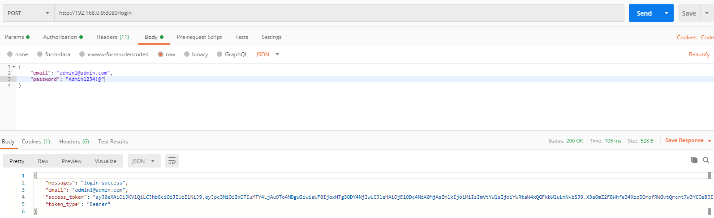

# Users Restful API
JWT 토큰기반 인증방식을 사용한 회원관리 Restful API 구현

## Stack
- PHP 7.3
- MySQL 5.7
- Codeigniter4

## Step
1. users.sql 실행 (초기 관리자 셋팅을 위해 insert구문까지 등록)
2. 로그인을 통해 사용자 토큰을 발급받습니다.
3. 발급된 토큰을 Headers의 Authorization에 등록 후 api를 호출합니다.

<br>

## Login
**초기 관리자 이메일과 패스워드는 users.sql insert문 주석에 적혀있습니다.**
```
[POST] /login  회원 로그인(인증)

Request
Parameters
    email     string 사용자 이메일
    password  string 사용자 암호
Headers
     Context-Type: application/json
     
Response 200
Header
    Context-Type: application/json
Body
{
    "messages": "login success",
    "email: "test@abc.com",
    "access_token" : "token_info"
}

```

## Users
**로그인 인증 성공 후 access_token을 발급받아 사용**
```
[GET] /users  여러 회원 목록 조회

Request
Parameters
    name   string 사용자 이름으로 조회 (Example: juho)   
    email  string 사용자 이메일로 조회 (Example: test@abc.com)
    limit  int    출력 갯수
    offset int    출력 시작 row
Headers
     Context-Type: application/json
     Authorization: Bearer {access_token}
```

```
[GET] /users/{id}  단일 회원 상세 정보 조회

Request
Parameters
    id int (requrid) 사용자 코드
Headers
     Context-Type: application/json
     Authorization: Bearer {access_token}
```

```
[POST] /users 회원 가입

Request
Parameters
     name      string (required) 사용자 이름
     nickname  string (required) 사용자 별명
     password  string (required) 사용자 비밀번호
     phone     string (required) 사용자 전화번호
     email     string (required) 사용자 이메일 
     gender    string 사용자 성별
Headers
     Context-Type: application/json
     Authorization: Bearer {access_token}
```
